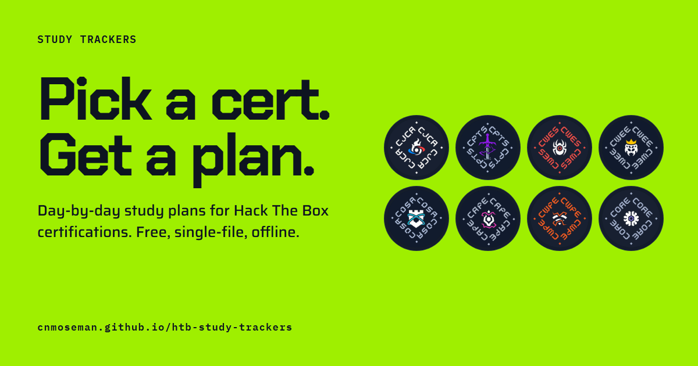
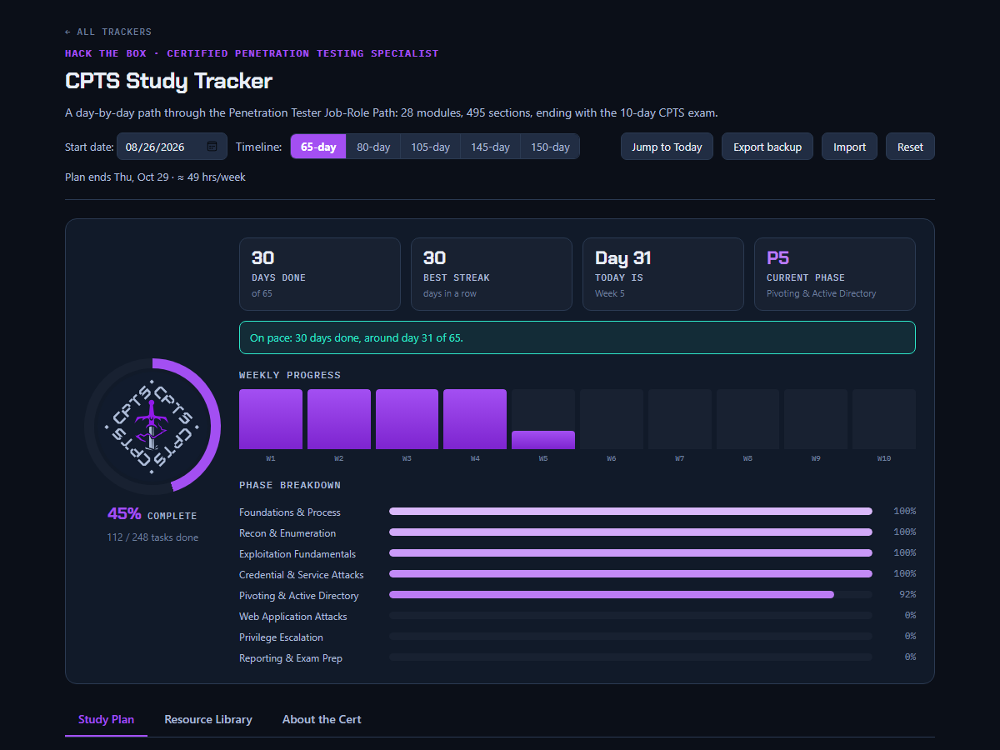

# Study Trackers

Day-by-day study plans for eight Hack The Box certifications. Pick a cert, choose how many hours a week you can put in, and check off tasks as you go.

**Open the site: https://cnmoseman.github.io/htb-study-trackers/**

## The trackers

| Cert | Name | Path | Timelines |
|---|---|---|---|
| [CJCA](https://cnmoseman.github.io/htb-study-trackers/cjca/) | Certified Junior Cybersecurity Associate | 20 modules, 5-day exam | 25 to 90 days |
| [CPTS](https://cnmoseman.github.io/htb-study-trackers/cpts/) | Certified Penetration Testing Specialist | 28 modules, 10-day exam | 65 to 150 days |
| [CWES](https://cnmoseman.github.io/htb-study-trackers/cwes/) | Certified Web Exploitation Specialist | 20 modules, 7-day exam | 30 to 110 days |
| [CWEE](https://cnmoseman.github.io/htb-study-trackers/cwee/) | Certified Web Exploitation Expert | 15 modules, 10-day exam | 35 to 80 days |
| [CDSA](https://cnmoseman.github.io/htb-study-trackers/cdsa/) | Certified Defensive Security Analyst | 15 modules, 7-day exam | 30 to 60 days |
| [CAPE](https://cnmoseman.github.io/htb-study-trackers/cape/) | Certified Active Directory Pentesting Expert | 15 modules, 10-day exam | 45 to 75 days |
| [CWPE](https://cnmoseman.github.io/htb-study-trackers/cwpe/) | Certified Wi-Fi Pentesting Expert | 10 modules, 7-day exam | 25 to 55 days |
| [COAE](https://cnmoseman.github.io/htb-study-trackers/coae/) | Certified Offensive AI Expert | 12 modules, 7-day exam | 30 to 90 days |

## What's in a tracker

Each one takes the cert's HTB Academy job-role path and splits it into days, following the modules in order. The dashboard shows how much you've finished, your streak, which phase you're in, and whether you're ahead of or behind pace.

There are five timelines per cert, based on how many hours a week you have. The same material gets packed into more or fewer days, and your checkmarks carry over if you switch. Hours come from HTB's own per-module estimates, so the pacing is realistic.

Every day has a notes box for commands, credentials, and anything you want to come back to. The resource library links the official cert and path pages, every module in order, video reviews, exam write-ups from people who passed, reporting templates, and the main tools.

## How to use

1. Open a tracker from the site, or download its HTML file.
2. Set your start date and pick a timeline.
3. Check off tasks as you finish them. A day is done when all of its tasks are.
4. Use **Export backup** every so often to save your progress.

## Where your progress lives

Your progress is saved in your browser, separately for each tracker, and it never leaves it. There's no account. Progress doesn't sync between devices, so use Export and Import to move it.

The live site counts page visits with [GoatCounter](https://www.goatcounter.com/), which doesn't use cookies or collect personal data. Downloaded copies don't count anything.

Each tracker is a single HTML file with its fonts and images built in, so a downloaded copy works offline.

## Hosted or downloaded?

Using a tracker on the site is the easy way to start, and most updates won't touch your progress. Fixes to wording, resources, hours, or timelines keep your checkmarks where they are. A bigger change, like adding or reordering days or tasks, can shift saved progress onto the wrong items, though. If you want a copy that never changes under you, download the HTML file and run it locally. Either way, export a backup now and then.

## Practice labs and paid content

Some trackers point you to practice on HTB Labs. Retired machines and challenges usually need a VIP+ subscription, and Pro Labs need their own. When a tracker names a specific box, challenge, or lab, it says whether it's Free, VIP+, or Pro Labs. HTB sometimes moves retired boxes into the free rotation, so check the Labs page too.

## Suggest a resource

Found a write-up, video, or practice box that helped you? [Suggest it here](https://github.com/cnmoseman/htb-study-trackers/issues/new?template=suggest-resource.yml). Spotted a wrong module or a dead link? [Report a problem](https://github.com/cnmoseman/htb-study-trackers/issues/new?template=report-problem.yml). I read every submission before anything goes into a tracker.

## Credits

This project started from [mattrfield's coae-study-tracker](https://github.com/mattrfield/coae-study-tracker). These are independent study aids, not affiliated with or endorsed by Hack The Box.

## License

The trackers are MIT licensed. See [LICENSE](LICENSE). The code builds on mattrfield's coae-study-tracker, so the original copyright notice is kept.

Each tracker embeds two fonts, Chakra Petch and IBM Plex Mono. Both are under the SIL Open Font License 1.1, and their license files are in [LICENSES/](LICENSES/).
