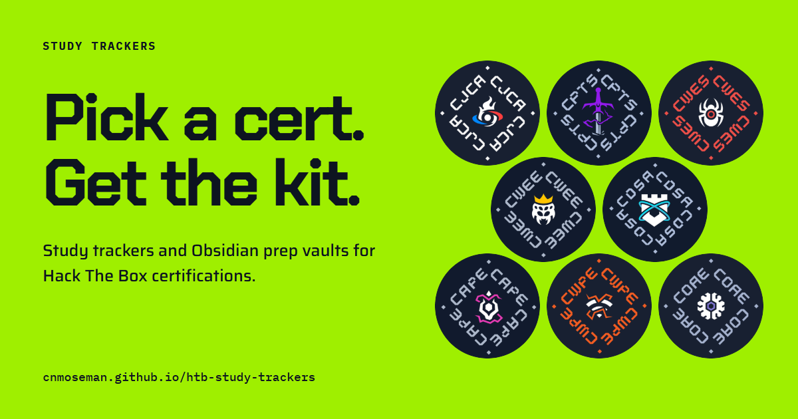
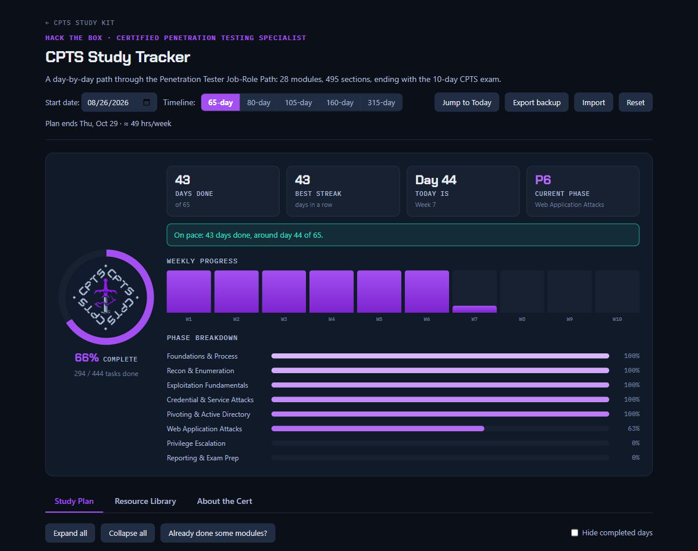
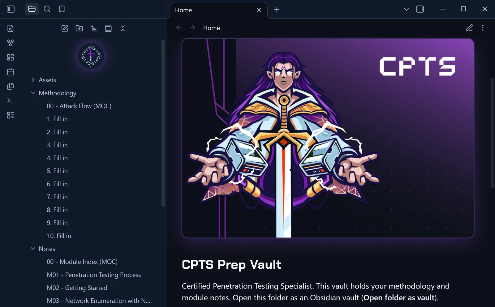

# Study Trackers

Study trackers and Obsidian prep vaults for Hack The Box certifications. Each cert gets two things: a day-by-day study plan you check off as you go, and a ready-made Obsidian vault for your notes.

**Open the site: https://cnmoseman.github.io/htb-study-trackers/**

## The certs

Each cert's page has its tracker and its prep vault.

| Cert | Name | Path | Timelines |
|---|---|---|---|
| [CJCA](https://cnmoseman.github.io/htb-study-trackers/cjca/) | Certified Junior Cybersecurity Associate | 20 modules, 5-day exam | 25 to 130 days |
| [CPTS](https://cnmoseman.github.io/htb-study-trackers/cpts/) | Certified Penetration Testing Specialist | 28 modules, 10-day exam | 65 to 315 days |
| [CWES](https://cnmoseman.github.io/htb-study-trackers/cwes/) | Certified Web Exploitation Specialist | 20 modules, 7-day exam | 30 to 150 days |
| [CWEE](https://cnmoseman.github.io/htb-study-trackers/cwee/) | Certified Web Exploitation Expert | 15 modules, 10-day exam | 35 to 180 days |
| [CDSA](https://cnmoseman.github.io/htb-study-trackers/cdsa/) | Certified Defensive Security Analyst | 15 modules, 7-day exam | 30 to 155 days |
| [CAPE](https://cnmoseman.github.io/htb-study-trackers/cape/) | Certified Active Directory Pentesting Expert | 15 modules, 10-day exam | 45 to 225 days |
| [CWPE](https://cnmoseman.github.io/htb-study-trackers/cwpe/) | Certified Wi-Fi Pentesting Expert | 10 modules, 7-day exam | 25 to 120 days |
| [COAE](https://cnmoseman.github.io/htb-study-trackers/coae/) | Certified Offensive AI Expert | 12 modules, 7-day exam | 30 to 140 days |

## Study trackers

The trackers all work the same way, whichever cert you pick.

- Each one splits the cert's HTB Academy job-role path into days and follows the modules in order.
- You choose one of five timelines, for about 50, 40, 30, 20, or 10 hours of study a week. The hours come from HTB's own module estimates, and your checkmarks carry over if you switch.
- The dashboard shows your overall progress, your streak, which phase you're in, and whether you're ahead of or behind pace.
- Every day has a notes box for commands, credentials, and anything you want to come back to.
- The resource library links the official cert and path pages, every module in order, video reviews, exam write-ups from people who passed, reporting templates, and the main tools.
- If you've already finished some modules on HTB Academy, tick them under **Already done some modules?** and the tracker checks off their study tasks.
- Export and Import let you back up your progress or move it to another device.
- The site's home page shows a progress ring on each tracker you've started, so you can pick up where you left off.
- Each tracker is a single HTML file with its fonts and images built in, so it works offline.

## Obsidian prep vaults

Every cert also has a prep vault: a ready-made Obsidian vault you download as a zip, unzip, and open with **Open folder as vault**.

- A note for each module in the cert's path, in course order, ready for your commands and screenshots.
- Blank methodology phases you rename and fill in as your own workflow.
- Links to tested community cheat sheets for the cert, plus the cert's SysReptor report template.
- It only uses Obsidian's built-in features, so you don't need any plugins. You can browse every vault in [vaults/](vaults/) before downloading.

## How to use

Open the [site](https://cnmoseman.github.io/htb-study-trackers/) and pick your cert. Its page has both the tracker and the prep vault.

### Study tracker

1. Click **Open tracker**, or **Download .html** to keep a copy that runs offline in any browser. The site and a downloaded copy keep separate progress, so pick one and stick with it.
2. Set your start date and pick the timeline that matches the hours you have each week.
3. Check off tasks as you finish them. A day is done when all of its tasks are.
4. Use **Export backup** now and then to save your progress. **Import** puts it back, on the same device or a new one.

### Prep vault

1. Install [Obsidian](https://obsidian.md) (free).
2. On your cert's page, click **Download .zip** and unzip it. Some unzip tools add an extra folder around it. The one you want is `<CERT>-Prep-Vault`, with `Home.md` inside.
3. In Obsidian, choose **Open folder as vault** and pick that folder. If you already have a vault open, you'll find this option in the vault switcher.
4. Start on **Home**. Rename the methodology phases to fit how you work, and fill in each module's note as you finish it.

## FAQ

https://cnmoseman.github.io/htb-study-trackers/faq/

## Where your progress lives

Your progress is saved in your browser, separately for each tracker, and it never leaves it. There's no account. Progress doesn't sync between devices, so use Export and Import to move it.

## Hosted or downloaded?

Using a tracker on the site is the easy way to start, and most updates won't touch your progress. Fixes to wording, resources, hours, or timelines keep your checkmarks where they are. A bigger change, like adding or reordering days or tasks, can shift saved progress onto the wrong items, though. If that happens, the tracker shows a "Plan updated" banner the next time you open it, so you know to look over your recent days. If you want a copy that never changes under you, download the HTML file and run it locally. Either way, export a backup now and then.

## Practice labs and paid content

Some trackers point you to practice on HTB Labs. Retired machines and challenges usually need a VIP+ subscription, and Pro Labs need HTB PRO. When a tracker names a specific box, challenge, or lab, it says whether it's Free, VIP+, or Pro Labs. HTB sometimes moves retired boxes into the free rotation, so check the Labs page too.

## Suggest a resource

Found a write-up, video, or practice box that helped you? [Suggest it here](https://github.com/cnmoseman/htb-study-trackers/issues/new?template=suggest-resource.yml). Spotted a wrong module or a dead link? [Report a problem](https://github.com/cnmoseman/htb-study-trackers/issues/new?template=report-problem.yml). I read every submission before anything goes into a tracker or a prep vault.

## Credits

This project started from [mattrfield's coae-study-tracker](https://github.com/mattrfield/coae-study-tracker). These are independent study aids, not affiliated with or endorsed by Hack The Box.

## License

The trackers are MIT licensed. See [LICENSE](LICENSE). The code builds on mattrfield's coae-study-tracker, so the original copyright notice is kept.

Each tracker embeds two fonts, Chakra Petch and IBM Plex Mono. Both are under the SIL Open Font License 1.1, and their license files are in [LICENSES/](LICENSES/).
